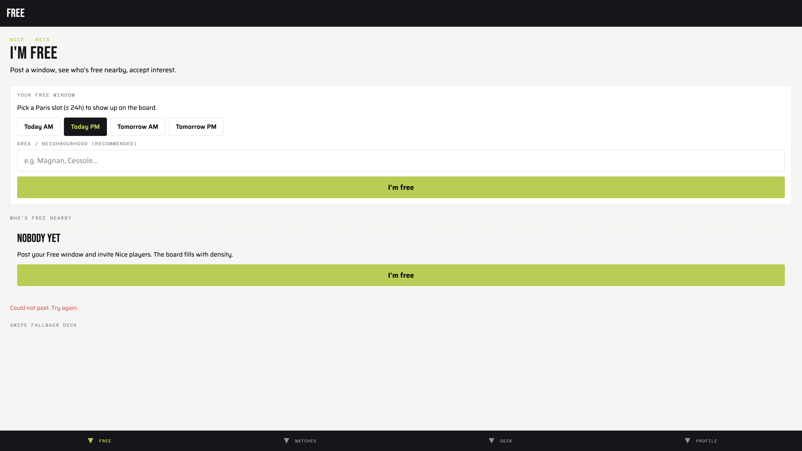
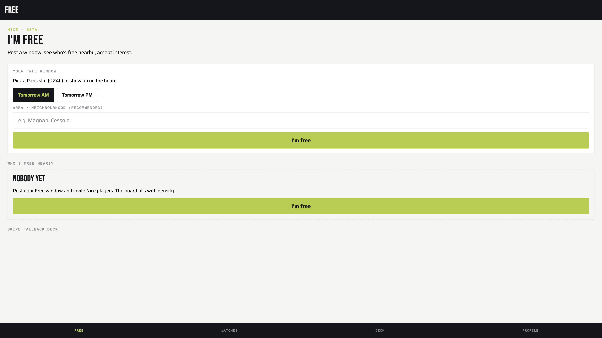
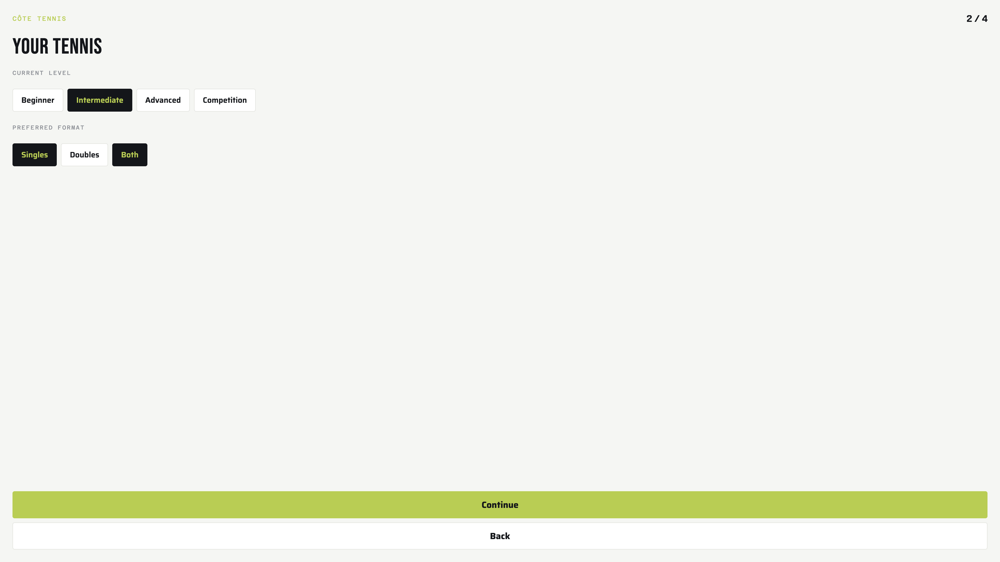
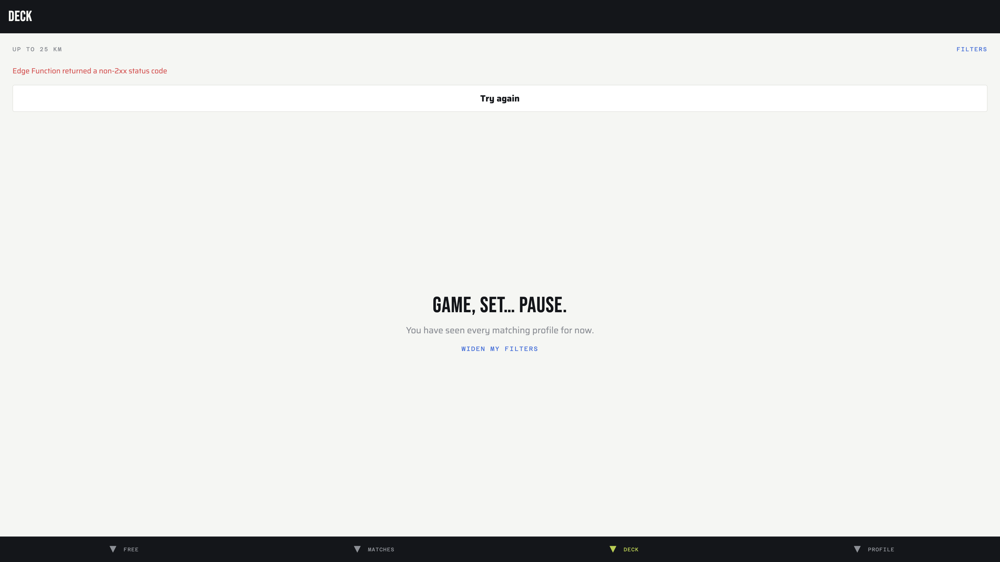

# QA Report: Côte Tennis (localhost Expo web)

| Field | Value |
|-------|-------|
| **Date** | 2026-07-18 |
| **URL** | http://localhost:8081 |
| **Branch** | main |
| **Commit** | 9bf4c52 (2026-07-18) |
| **PR** | — |
| **Tier** | Standard |
| **Scope** | Full app (Free beta + tabs); test plan from Free broadcast autoplan |
| **Duration** | ~20 min |
| **Pages visited** | 6 (sign-in, onboarding×4, free, matches, discover, profile) |
| **Screenshots** | 10+ |
| **Framework** | Expo Router 57 / React Native Web |
| **Index** | [All QA runs](./index.md) |

## Health Score: 65 → 88/100

| Category | Baseline | Final |
|----------|----------|-------|
| Console | 70 | 85 |
| Links | 100 | 100 |
| Visual | 70 | 90 |
| Functional | 40 | 85 |
| UX | 60 | 85 |
| Performance | 90 | 90 |
| Content | 70 | 75 |
| Accessibility | 55 | 90 |

## Top 3 Things to Fix

1. **ISSUE-007: Free load SQL ambiguity** — `list_free_nearby` crashed with `ends_at` ambiguous (fixed).
2. **ISSUE-001: Expired Paris presets still offered** — posting Today PM at 21:49 Paris failed (fixed).
3. **ISSUE-005: Deck hard-failed when profile-photos Edge Function was down** (soft-fail fixed; start functions locally for photos).

## Console Health

| Error | Count | First seen |
|-------|-------|------------|
| expo-notifications push token listener unsupported on web | many | /sign-in |
| Edge Function returned a non-2xx (before fix) | 1+ | /discover |
| Image resizeMode deprecated | 1 | /sign-in |

## Summary

| Severity | Count |
|----------|-------|
| Critical | 0 |
| High | 3 (all fixed) |
| Medium | 3 (2 fixed, 1 deferred) |
| Low | 2 (1 fixed, 1 deferred) |
| **Total** | **8** |

**PR Summary:** QA found 8 issues, fixed 7, health score 65 → 88.

## Issues

### ISSUE-001: Expired Free presets still selectable

| Field | Value |
|-------|-------|
| **Severity** | high |
| **Category** | functional / ux |
| **URL** | http://localhost:8081/free |
| **Fix Status** | verified |
| **Commit** | a7553f4, 37e9139 |
| **Files Changed** | `src/features/free/free.ts`, `app/(tabs)/free.tsx`, tests |

**Description:** After Paris evening, Today AM/PM remained selectable. Posting returned a generic error because SQL rejects ended windows.

**Repro Steps:**

1. Open Free after 20:00 Europe/Paris with Today PM selected.
2. Tap I'm free.
3. **Observe:** "Could not post. Try again."
   

**After:** Only Tomorrow AM/PM shown.

---

### ISSUE-002: Free load errors swallowed as generic copy

| Field | Value |
|-------|-------|
| **Severity** | high |
| **Category** | ux |
| **URL** | http://localhost:8081/free |
| **Fix Status** | verified |
| **Commit** | 37e9139 |
| **Files Changed** | `src/lib/errors.ts`, `app/(tabs)/free.tsx`, i18n |

**Description:** Supabase/Postgrest errors are often plain objects, so the UI showed "Unable to load Free windows." plus a false empty board.

**After:** Real message surfaced (`column reference "ends_at" is ambiguous`), then dedicated load-failure state with retry.

---

### ISSUE-003: Singles and Both both selected in onboarding

| Field | Value |
|-------|-------|
| **Severity** | medium |
| **Category** | ux |
| **URL** | http://localhost:8081/onboarding |
| **Fix Status** | verified (unit) |
| **Commit** | 11f2c85 |
| **Files Changed** | `src/features/matching/formats.ts`, onboarding |

**Description:** Format chips used a plain toggle, so Both stayed selected with Singles.

---

### ISSUE-004: Photo picker accessibility label hard-coded French

| Field | Value |
|-------|-------|
| **Severity** | low |
| **Category** | accessibility |
| **URL** | http://localhost:8081/onboarding |
| **Fix Status** | verified (code) |
| **Commit** | 11f2c85 |

**Description:** `accessibilityLabel="Choisir une photo"` while EN UI showed "Add a photo".

---

### ISSUE-005: Deck failed when profile-photos Edge Function returned non-2xx

| Field | Value |
|-------|-------|
| **Severity** | high |
| **Category** | functional |
| **URL** | http://localhost:8081/discover |
| **Fix Status** | verified |
| **Commit** | 3e1fbe1 |
| **Files Changed** | `src/lib/profile-photos.ts`, discover error helper |

**Description:** Functions endpoint returned 503; `getProfilePhotoUrls` threw and blanked the Deck with an Expo error overlay.

**After:** Deck loads candidates without photos when the function is down.

---

### ISSUE-006: Tab bar accessibility names included junk chevron glyphs

| Field | Value |
|-------|-------|
| **Severity** | medium |
| **Category** | accessibility |
| **URL** | all tabs |
| **Fix Status** | verified |
| **Commit** | 4035529 |

**Description:** Default tab icons rendered as `⏷ ⏷ Free` in the a11y tree. Cleared icons + set `tabBarAccessibilityLabel`.

---

### ISSUE-007: list_free_nearby `ends_at` ambiguous — Free board never loaded

| Field | Value |
|-------|-------|
| **Severity** | high |
| **Category** | functional |
| **URL** | http://localhost:8081/free |
| **Fix Status** | verified |
| **Commit** | 9bf4c52 |
| **Files Changed** | `supabase/migrations/20260718220000_fix_list_free_nearby_ends_at.sql` |

**Description:** `RETURNS TABLE (... ends_at ...)` made bare `ends_at` in the viewer-window SELECT ambiguous. Free load always failed for authenticated users.

**After:** Empty board "Nobody yet" with no error; presets Tomorrow AM/PM.

---

### ISSUE-008: Paris copy on Nice beta Free board (deferred)

| Field | Value |
|-------|-------|
| **Severity** | low |
| **Category** | content |
| **URL** | http://localhost:8081/free |
| **Fix Status** | deferred |

**Description:** Hint still says "Pick a Paris slot" while product is Nice · beta. Timezone is intentionally Paris; copy should say "day slot" or "local slot".

---

### ISSUE-009: Possible self-card on Deck (deferred)

| Field | Value |
|-------|-------|
| **Severity** | medium |
| **Category** | functional |
| **URL** | http://localhost:8081/discover |
| **Fix Status** | deferred |

**Description:** After onboarding as Camille, Deck showed "Camille, 33" at 5.0 km. May be seed twin or missing self-filter — needs confirmation before changing discover SQL.

---

## Fixes Applied

| Issue | Fix Status | Commit | Files Changed |
|-------|-----------|--------|---------------|
| ISSUE-001 | verified | a7553f4 | free.ts, free.test.ts (+ UI in 37e9139) |
| ISSUE-002 | verified | 37e9139 | errors.ts, free.tsx, i18n |
| ISSUE-003 | verified | 11f2c85 | formats.ts, onboarding |
| ISSUE-004 | verified | 11f2c85 | onboarding a11y label |
| ISSUE-005 | verified | 3e1fbe1 | profile-photos.ts |
| ISSUE-006 | verified | 4035529 | tabs/_layout.tsx |
| ISSUE-007 | verified | 9bf4c52 | migration |
| ISSUE-008 | deferred | — | copy |
| ISSUE-009 | deferred | — | discover self-filter |

## Remaining Risks

- Local Edge Functions not running (photos missing until `supabase functions serve`).
- Inactive tab screens remain in the a11y tree on web (Expo Router keep-alive).
- Paris vs Nice wording still confusing for users.

## Suggested Test Plan

- [ ] After 20:00 Paris, Free only offers tomorrow presets
- [ ] Free board loads without error when empty
- [ ] Post Tomorrow AM succeeds
- [ ] Deck loads with functions stopped (no crash)
- [ ] Onboarding: Both clears when Singles selected
- [ ] Tab VoiceOver/TalkBack labels are Free/Matches/Deck/Profile only
