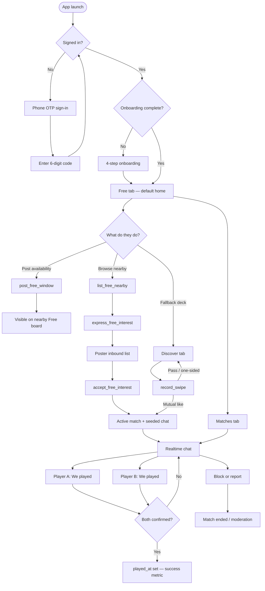

<!-- Explanation: why Free-first matchmaking, and the end-to-end player journey. -->

# Why Free-first, and how a player moves through the app

Côte Tennis exists so adult players around the Côte d’Azur can get on court with someone nearby. The closed beta north star is **stranger played** (both sides confirm “We played”), not match count.

## The problem

Swipe-only discovery optimizes for profile browsing. In a thin local market, empty decks and slow mutual likes kill momentum before anyone books a court. The product needed a path where “I’m free this afternoon” is visible immediately, without exposing phone numbers or exact GPS.

## The approach

**Free windows** are the default home (`/` → `/free`). A player posts a short time window (Paris presets or custom ≤24h). Neighbors see a privacy-safe card (first name, level, formats, distance band, area/courts — never phone or coordinates). Interest is one-sided until the poster **Accepts**, which creates a match, seeds chat, and opens the dual **We played** confirm.

Mutual swipe on **Deck** remains as fallback when the Free board is empty or someone prefers browsing.

### Glossary (EN / FR)

| EN | FR |
|----|----|
| Free | Je suis dispo |
| Interested | Ça m’intéresse |
| Accept | Accepter |
| We played | On a joué |
| Deck | Discover swipe fallback |

## Soft gates

1. **Default:** both viewer and poster have `profiles.city` normalized to Nice.
2. **Contingency:** if `beta_invitees` has any row, both sides must be invitees (city gate off).

Distance for Free cards is capped at **15 km**. Exact coordinates never leave the RPC DTO.

## Trade-offs

| Choice | Gain | Cost |
|--------|------|------|
| Free as default home | Faster path to a timed intent | Empty board hurts more than empty deck — density ops matter |
| RPC-only stranger DTOs | No accidental profile joins leaking PII | Clients cannot invent Free queries; contract must stay documented |
| Paris wall-clock presets | Consistent slots without client TZ bugs | Copy that says “Paris” can confuse Nice players (known QA note) |
| Dual confirm for `played` | Harder to game the north-star metric | Incomplete sessions stay “matched but not played” |
| Week 1: no Free push fan-out | Less spam while density is low | Discovery is in-app only until digests ship |
| Keep swipe fallback | Safety net when Free is empty | Two discovery UIs to maintain until Free wins |

## Alternatives considered

- **Swipe-only:** rejected for closed beta; Free is the discovery spine (`README`, product boundaries).
- **Public open feed:** rejected — product boundaries forbid open feeds and ratings.
- **Court booking / payments:** out of scope for this product.

## Related

- [Architecture reference](./reference-architecture.md)
- [Free RPC contract](./free-rpc-contract.md)
- [How to run closed beta](./howto-closed-beta.md)
- [Getting started tutorial](./tutorial-getting-started.md)
